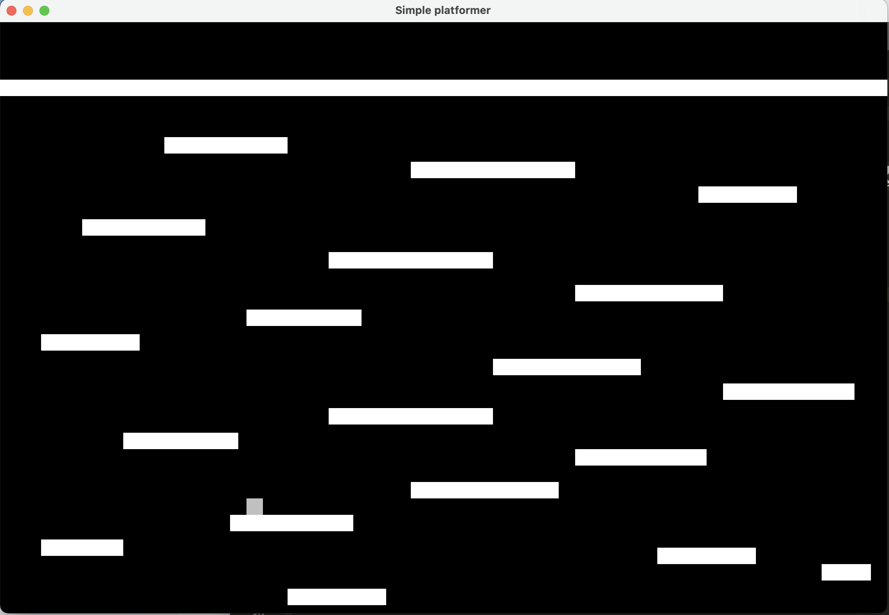

# Java Platformer

A minimalist Java-based platformer game where you control a square jumping from platform to platform.



## Overview

This project is a simple physics-based platformer game built entirely in Java. Control a light gray square as it navigates through a series of floating platforms. There are no objectives, points, or enemies - just the pure joy of movement and platforming mechanics.

## Features

- **Physics-Based Movement**: Includes velocity, gravity, and collision detection
- **Simple Controls**: Use arrow keys to navigate your character
- **Minimalist Design**: Clean white platforms against a dark background
- **Endless Play**: No win conditions or game over screens - just jump around to your heart's content

## How It Works

The game is built with several key components:

### Core Components

- **Universe**: The physics engine that handles gravity and movement
- **Entity**: Base class for objects with physical properties
- **Player**: A controllable entity responding to keyboard input
- **Platform**: Static objects that the player can stand on
- **GameFrame/GamePanel**: UI components for rendering the game

### Game Physics

The game implements a simple physics engine that handles:
- Gravity (objects fall downward)
- Velocity (objects can move in any direction)
- Collisions (objects cannot pass through each other)
- Leverage (player can only jump when standing on a platform)

## Controls

- **Left Arrow**: Move left
- **Right Arrow**: Move right
- **Up Arrow**: Jump (only works when standing on a platform)
- **Down Arrow**: Move down (when applicable)

## Running the Game

### Prerequisites

- Java Development Kit (JDK) 16 or higher
- Any Java IDE (IntelliJ IDEA, Eclipse, NetBeans, etc.)

### Compilation and Execution

1. Clone the repository
2. Open the project in your preferred Java IDE
3. Build the project
4. Run `javaplatformer.Process.Process` as the main class

## Project Structure

```
javaplatformer/
├── GameLogic/
│   ├── Entity.java
│   ├── PhysicalObject.java
│   ├── Platform.java
│   └── Player.java
├── Physics/
│   ├── Universe.java
│   └── Velocity.java
├── Process/
│   ├── GameFrame.java
│   ├── GamePanel.java
│   ├── Moveable.java
│   ├── Paintable.java
│   └── Process.java
└── DataTransferObjects/
    ├── PaintInformation.java
    └── DEBUG/
        └── Debug.java
```

## Technical Details

- Built with pure Java and Swing for graphics
- Uses object-oriented design principles
- Implements basic physics concepts like velocity and gravity
- Uses a game loop for continuous updates and rendering

## Future Improvements

While this is intentionally minimalist, here are some potential enhancements:
- Add sound effects
- Implement a score system
- Create additional levels
- Add collectible items
- Introduce moving platforms
- Implement enemies or obstacles

## License

This project is licensed under the MIT License - see the LICENSE file for details.

## Acknowledgments

This project was created as a fun exercise in Java game development and physics simulation.

---

*"Sometimes the simplest games are the most fun to make." - Game Developer Proverb*